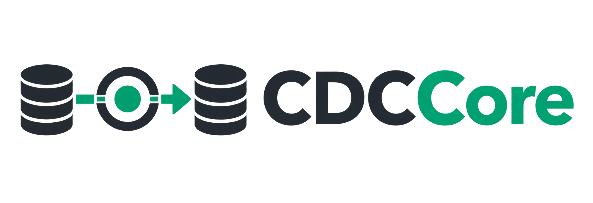

<p align="center">
  
</p>

<p align="center"><strong>Consumer and Replicator for Change Data Capture</strong></p>

O **CDCCore** captura alterações feitas em um PostgreSQL e as replica para um destino. Ele lê o WAL por replicação lógica, transforma cada `INSERT`, `UPDATE` e `DELETE` em um evento estruturado e processa a transação no destino antes de confirmar o progresso na origem.

O projeto foi escrito em Go e usa apenas recursos nativos do PostgreSQL. Não precisa de Kafka, Debezium ou outra fila.

## O que o projeto faz

```text
PostgreSQL de origem
        |
        v
  WAL + pgoutput
        |
        v
Replication slot
        |
        v
     CDCCore
        |
        +----> arquivo JSON Lines
        |
        +----> PostgreSQL de destino
```

Cada execução usa um único destino, escolhido por `CDC_SINK`:

- `postgres`: replica os dados para outro PostgreSQL;
- `file`: grava os eventos em um arquivo JSON Lines.

O CDCCore ainda não distribui o mesmo evento para vários destinos ao mesmo tempo.

## Início rápido

### Requisitos

- Docker com Docker Compose;
- portas `5432`, `5433` e `8080` livres.

### 1. Configure o ambiente

Na raiz do projeto, crie o arquivo local de configuração:

```bash
cp consumer/.env.example consumer/.env
```

O arquivo `consumer/.env` é ignorado pelo Git. Altere as senhas antes de usar o projeto fora de um ambiente local.

### 2. Inicie o projeto

```bash
docker compose up -d --build
```

Esse comando inicia:

- PostgreSQL de origem em `localhost:5432`;
- PostgreSQL de destino em `localhost:5433`;
- criação da publication e do replication slot;
- CDCCore como consumidor dos eventos.

Confira o estado dos servicos:

```bash
docker compose ps
```

### 3. Gere uma alteração

Insira um cliente no banco de origem:

```bash
docker compose exec -T postgres psql -U postgres -d cdc_demo -c \
"INSERT INTO clientes (nome, email) VALUES ('Maria', 'maria@exemplo.com');"
```

### 4. Confira a replicação

Consulte a mesma tabela no banco de destino:

```bash
docker compose exec -T postgres-target psql -U postgres -d cdc_demo -c \
"TABLE clientes;"
```

O registro de Maria deve aparecer no resultado. Isso confirma o caminho completo: origem, WAL, replication slot, CDCCore e destino.

## Configuração principal

As configurações ficam em `consumer/.env`.

### Conexão com a origem

```dotenv
CDC_SOURCE_PGHOST=localhost
CDC_SOURCE_PGPORT=5432
CDC_SOURCE_PGDATABASE=cdc_demo
CDC_SOURCE_PGUSER=postgres
CDC_SOURCE_PGPASSWORD=postgres
CDC_SOURCE_PGSSLMODE=disable
```

### Conexão com o destino

```dotenv
CDC_DEST_PGHOST=localhost
CDC_DEST_PGPORT=5433
CDC_DEST_PGDATABASE=cdc_demo
CDC_DEST_PGUSER=postgres
CDC_DEST_PGPASSWORD=postgres
CDC_DEST_PGSSLMODE=disable
```

### Captura e aplicação

```dotenv
CDC_SINK=postgres
CDC_POSTGRES_APPLY_MODE=generic
CDC_TABLE_INCLUDE=public.clientes,public.enderecos
CDC_PUBLICATION_AUTOCONFIGURE=true
```

| Variável | Para que serve |
| --- | --- |
| `CDC_SINK` | Escolhe o destino: `postgres` ou `file`. |
| `CDC_POSTGRES_APPLY_MODE` | Usa aplicação `explicit` ou `generic`. |
| `CDC_TABLE_INCLUDE` | Lista as tabelas permitidas no formato `schema.tabela`. |
| `CDC_PUBLICATION_AUTOCONFIGURE` | Adiciona automaticamente essas tabelas à publication quando vale `true`. |
| `CDC_SLOT` | Define o replication slot. O padrão é `cdc_slot`. |
| `CDC_PUBLICATION` | Define a publication. O padrão é `cdc_publication`. |
| `CDC_SOURCE_ID` | Identifica a origem para controle de idempotência. |

No modo `generic`, as tabelas precisam existir no destino e possuir chave primária. O CDCCore replica os dados, mas não cria nem atualiza o schema das tabelas.

Depois de alterar o `.env`, recrie o consumidor:

```bash
docker compose up -d --build consumer
```

## Modos de aplicação no PostgreSQL

### `explicit`

Usa código dedicado para as tabelas `public.clientes` e `public.enderecos`. Esse é o modo padrão e serve como exemplo de regras específicas por tabela.

### `generic`

Consulta as colunas e a chave primária no destino e monta os comandos SQL automaticamente. Somente as tabelas presentes em `CDC_TABLE_INCLUDE` são aceitas.

## Monitoramento

Com o ambiente Docker ativo, estão disponíveis:

- `http://localhost:8080/livez`: informa se o processo está vivo;
- `http://localhost:8080/readyz`: informa se o consumidor está pronto;
- `http://localhost:8080/metrics`: apresenta contadores e os últimos LSNs em JSON.

Para acompanhar os logs:

```bash
docker compose logs -f consumer
```

## Garantias importantes

- As fronteiras das transações da origem são preservadas.
- O LSN só é confirmado depois que o sink aceita a transação.
- O PostgreSQL Sink aplica todos os eventos dentro de uma transação no destino.
- Transações já aplicadas são identificadas por `source_id` e `commit_lsn`, evitando reaplicação no PostgreSQL.
- Em caso de falha, o consumidor tenta se reconectar com espera progressiva.

No File Sink, a entrega é **at-least-once**: depois de determinadas falhas, uma linha pode aparecer novamente no arquivo.

## Executar sem o consumidor Docker

Pare o consumidor do Compose e deixe apenas os bancos e a preparação do slot no Docker:

```bash
docker compose stop consumer
docker compose up -d postgres postgres-target create-slot
```

Execute o consumidor diretamente com Go:

```bash
cd consumer
go run .
```

Use `Ctrl+C` para encerrar de forma segura.

## Testes

Os testes de integração usam o replication slot real. Como um slot só pode ter um consumidor ativo, pare o consumidor do Compose antes de executar a suíte:

```bash
docker compose stop consumer
cd consumer
go test -v ./...
```

Depois dos testes, volte para a raiz e inicie o consumidor novamente:

```bash
cd ..
docker compose up -d consumer
```

## Estrutura do projeto

```text
.
|-- assets/                 # Logo e recursos visuais
|-- consumer/               # Aplicação Go, sinks e testes
|-- docs/                   # Estado e documentação técnica
|-- postgres/init/          # Banco e tabelas do ambiente local
|-- scripts/                # Criacao do slot e teste manual
|-- docker-compose.yml      # Ambiente local completo
`-- README.md
```

## Problemas comuns

### O slot já está ativo

Outro consumidor está usando `cdc_slot`. Pare o consumidor anterior antes de iniciar um novo:

```bash
docker compose stop consumer
```

### Uma tabela não foi replicada

Confira se ela:

- está em `CDC_TABLE_INCLUDE`;
- está na publication da origem;
- existe no destino;
- possui chave primária no modo `generic`.

### O consumidor não fica pronto

Consulte os logs e verifique as conexoes:

```bash
docker compose logs consumer
docker compose ps
```

## Limites atuais

- Uma transação grande permanece em memória até o `COMMIT`.
- Ainda não existem limites internos de memória, eventos ou bytes por transação.
- O streaming de transações grandes com `pgoutput` v2 ainda não foi implementado.
- O File Sink não oferece a mesma idempotência transacional do PostgreSQL Sink.

Para detalhes sobre protocolo, LSN, recuperação, segurança, transações grandes e decisões de implementação, consulte a [documentação técnica](docs/TECHNICAL.md) e o [estado do projeto](docs/STATUS.md).

## Licença

Consulte o arquivo [LICENSE](LICENSE).
